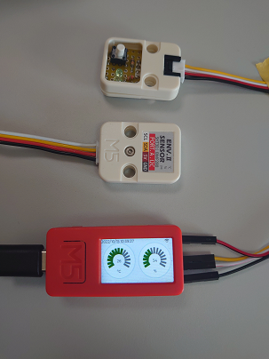

# M5StickCPlus_IDF_Sample

### M5StickC Plusをいろいろと試してみる。

### 使用機材
- [M5StickC Plus](https://www.switch-science.com/products/6470)
- M5Stack用温湿度気圧センサユニットVer.2
- [M5Stack用ミニプロトユニット](https://www.switch-science.com/collections/m5stack/products/6557)を使ったお手製ボタンとLEDユニット
- [M5Stack用メカニカルキーボタンユニット](https://www.switch-science.com/products/8303)
- [LVGL(Light and Versatile Graphics Library)](https://lvgl.io/)

### 動作

- WiFiに接続する。
- NTPサーバーと時刻同期し、RTCへ設定する。
- 環境センサー(外部)で、温度と湿度を測定する。
- ボタン(内蔵、外部)は、検知する。
- LED(内蔵、外部)は、点滅する。
- RGBなLED(外部)は、色を変化させながら点滅する。
- 6軸IMU(内蔵)は、計測する。
- ブザー(内蔵)は、鳴る。
- ディスプレイは、WiFi表示、日付/時間表示、湿度・温度表示、ボタンクリック時のOK表示をする。
